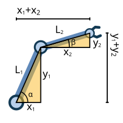

Ontwerpen
########################

Veelgebruikte robotsystemen
--------------------------------------------------------

.. admonition:: info
   :class: margin

   Benieuwd naar welke wieltypes er zijn voor robots? Dat is hier te lezen:   :doc:`Welke soorten robotwielen zijn er? <types_of_wheels>`

In dit hoofdstuk gaan we het hebben over ontwerpen. Om je een idee te geven waar je aan zou kunnen denken bij het ontwerpen, 
zullen we eerst even kijken naar veelgebruikte robotsystemen. De robotsystemen die we gaan bekijken heten *mobile manipulators*. 
Deze robots kunnen hoofdzakelijk twee dingen: zichzelf verplaatsen en de wereld om hen heen beïnvloeden.
De robot zit dus niet vast op een bepaalde plek, maar kan bewegen naar de plek waar hij nodig is. Vervolgens kan de robot daar een
actie uit gaan voeren.

**Hoe robots zich voortbewegen**

Er zijn veel verschillende manieren om een robot manoeuvreerbaar te maken. Afhankelijk van de omgeving waar een robot zich in gaat bevinden 
wordt een beweegmethode gekozen voor een robot. Je kan immers moeilijk dezelfde beweegmethode gebruiken op de vlakke grond van een warenhuis en de ruige grond in een bos. 
Ook kan  het zijn dat je robot in de lucht moet bewegen, of juist onder water. Voor al deze omgevingen heb je andere onderdelen. Vaak worden wielen gebruikt.
Wielen zijn namelijk erg geschikt voor vlakke ondergronden. Hierbij is het relatief makkelijk om een robot te maken dat rechtdoor kan rijden, maar het moeilijke zit in de bochten. 

.. figure:: https://www.tec-science.com/wp-content/uploads/2021/03/en-differential-gear-from-to-05-pinion-bevel-gears.jpg
    :alt: differentieel
    :width: 300
    :align: right

    **Figuur 1: Een differentieel** (COPYRIGHT?)

In de bochten zijn er namelijk twee problemen: er is een snelheidsverschil tussen de wielen, en de wielen moeten 
allemaal net niet dezelfde richting op rollen. Bij een bocht zitten de helft
van de wielen in de binnenbocht, en de andere helft in de buitenbocht. Zoals je waarschijnlijk wel weet is een binnenbocht altijd
korter dan de buitenbocht. Dit betekent dat wanneer een karretje een bocht maakt, de ene helft van de wielen meer afstand moet 
afleggen dan de ander. Dit veroorzaakt dus een snelheidsverschil. Dit verschil kan echter niet bestaan als de wielen direct aan 
elkaar gekoppeld zitten via een draaiende as. In dat geval gaat er een wiel moeten slippen. 
Je moet dan dus een manier hebben om het ene wiel sneller te laten draaien dan het andere. Vaak wordt hier een
*differentieel* voor gebruikt. Dit is een mechanisme dat bestaat uit een aantal tandwielen, zoals je kan zien in figuur 1. Met een differentieel kan je 2 wielen 
tegelijk aandrijven, ook als ze een onderling snelheidsverschil hebben.

.. figure:: https://upload.wikimedia.org/wikipedia/commons/thumb/a/a0/Ackermann_turning.svg/1200px-Ackermann_turning.svg.png
    :alt: Ackermann-sturing
    :width: 300
    :align: right

    **Figuur 2: Ackermann-sturing** (COPYRIGHT?)

Vervolgens hebben we een tweede probleem: Aangezien sommige wielen in de binnenbocht zitten en andere in de buitenbocht, 
legt niet elk wiel dezelfde cirkelbaan af in een bocht. Het resultaat is dat een wiel in de binnenbocht sterker met bijsturen 
dan een wiel in de buitenbocht. Om dit makkelijk te laten gebeuren wordt *Ackermann-sturing* gebruikt. Dit stangenmechanisme draait de 
wielen precies zo dat de bocht perfect gemaakt kan worden. Effectief zorgt het ervoor dat de draaiassen van alle wielen door 1 snijpunt gaan. 
Dat punt is dan precies het punt waar de auto omheen rijdt. Dit kan je zien in figuur 2.

In plaats van wielen worden ook soms rupsbanden gebruikt. Deze zijn erg geschikt als de ondergrond wat ruiger is. 
Om een bocht te maken laat je de ene rupsband expres harder draaien dan de ander. Hierdoor gaat de robot draaien. 
Je kan met rupsbanden niet een bocht maken zonder dat een stuk van de rupsband slipt. Het voordeel is echter dat 
rupsbanden veel meer grip hebben, dus kunnen ze zwaardere ladingen aan. 

.. figure:: https://flyingmag1.b-cdn.net/wp-content/uploads/sites/2/2024/12/travel-drones.jpg?resize=220,150&width=220&height=150
    :alt: Drone
    :width: 300
    :align: right

    **Figuur 3: Een drone** (COPYRIGHT?)

Een robot hoeft echter niet per se op de grond te blijven. Je hebt ook robots die de lucht in of onder water kunnen gaan. 
Om de lucht in te gaan wordt vaak een drone gebruikt. Een drone verplaatst zich door middel van een aantal propellers die samen de drone kunnen laten 
stijgen, dalen, draaien en verplaatsen. Zoals je kan zien in figuur 3, zitten de propellers allemaal met armen vast aan een centraal lichaam. Een drone is erg nuttig als de ondergrond 
slecht begaanbaar is. Een drone heeft over het algemeen minimaal 4 propellers. Er bestaan ook veel varianten met 6 of zelfs 8 propellers. Bij een drone hoef je 
niet de propellers steeds van richting te laten veranderen zoals bij de wielen van een auto. De drone verplaatst zich door enkel de 
draaisnelheden van zijn propellers individueel te veranderen. Je hebt ook drone's die vleugels hebben om over grote afstanden te kunnen zweven. Als een robot onderwater 
werkt worden ook vaak propellers gebruikt als voortstuwing. Meestal heeft de robot minstens 6 propellers, allemaal in verschillende richtingen. 
Hiermee kan de robot elke denkbare beweging onderwater uitvoeren. 

**Hoe robots hun omgeving kunnen manipuleren**

.. figure:: https://upload.wikimedia.org/wikipedia/commons/2/2a/6DOF.svg
    :alt: Degrees of freedom
    :width: 300
    :align: right

    **Figuur 3: Alle mogelijke vrijheidsgraden** (COPYRIGHT?)

Een *mobile-manipulator* moet objecten om hem heen kunnen bewegen. Er zijn veel manieren om dit te doen. 
In de praktijk hebben de meeste robots een bepaalde vorm van een arm. Een belangrijk concept bij deze *manipulators* 
zijn vrijheidsgraden, in het engels ook wel Degrees Of Freedom (DOF) genoemd. De vrijheidsgraden van een mechanisme 
zeggen iets over hoe vrij het mechanisme is om te bewegen. De exacte definitie is dat het aantal vrijheidsgraden gelijk is aan 
het aantal parameters die je nodig hebt om een systeem te beschrijven. Als je bijvoorbeeld de positie van een deur wil beschrijven, heb je maar 1 parameter nodig: 
De hoek tussen de deur en de muur. Door de scharnieren kan de deur namelijk maar beperkt bewegen. Hij kan niet zomaar een meter omhoog gaan bijvoorbeeld. Voor een vrijbewegend rigide object zijn er 6 vrijheidsgraden: 
3 voor positie en 3 voor oriëntatie. Het kan qua positie van boven naar beneden bewegen, van achter naar voren en van links naar rechts. Om de vrijheidsgraden van rotatie 
te begrijpen kan je je eigen hoofd gebruiken. Je kan namelijk op 3 manieren je hoofd draaien: je kan naar boven/beneden draaien, naar links/rechts draaien en je kan je hoofd schuinhouden!
In figuur 4 kan je de vrijheidsgraden zien. Als de grijper van de arm een van de bewegingen uit de figuur kan doen heeft het die vrijheidsgraad. Hierbij 
tellen 2 bewegingsrichtingen die op een lijn staan als 1 beweging/vrijheidsgraad (bijvoorbeeld naar voren en naar achteren).
met 6 vrijheidsgraden kan de grijper dus elke beweging maken die je kan bedenken, terwijl je met 1 vrijheidsgraad bijvoorbeeld alleen naar voren of naar achteren zou kunnen 
met de grijper. Met deze kennis kunnen we gaan kijken naar een aantal soorten robotarmen.

.. figure:: https://upload.wikimedia.org/wikipedia/commons/0/09/SCARA_robot_2R.png

    :alt: SCARA robot 
    :width: 300
    :align: right

    **Figuur 4: Een SCARA** (COPYRIGHT?)

Een *SCARA* (Selective Compliance Assembly Robot Arm) is een arm die wordt gebruikt voor zogeheten *pick and place* bewegingen. Het kan op een punt 
een object oppakken en het weer op een andere plek neerleggen. Het bestaat uit een onder- en bovenarm en een rondraaiende staaf die het object onderaan vasthoudt (zie figuur 4). 
De staaf kan omhoog en omlaag bewegen om het object op te tillen. De onderarm, boverarm en staaf kunnen alle 3 draaien en de staaf kan op en neer bewegen, dus heeft deze arm 
4 vrijheidsgraden. De 2 grote voordelen van een SCARA zijn de snelheid waarmee het beweegt en de stijfheid die het heeft tegen krachten die omhoog en omlaag duwen tegen de grijper. Dit maakt 
een SCARA erg geschikt voor het in elkaar zetten van onderdelen.

.. figure:: https://www.promation.be/storage/images/web/20221020-153409-1673348274.jpg

    :alt: delta robot
    :width: 300
    :align: right

    **Figuur 4: Een deltarobot** (COPYRIGHT?)

Een deltarobot is ook een *pick and place* robot, maar dan met 3 armen. De 3 armen worden bewogen door 3 motoren die bovenop zitten. Elke motor beweegt alleen maar een arm een 
stukje omhoog of omlaag. Dit is genoeg om de grijper heen en weer te laten bewegen. Door alle 3 de armen tegelijk omhoog of omlaag te doen kan een object opgetild worden. 
We hebben dan 3 bewegingsrichtingen en 0 rotatierichtingen; een deltarobot heeft dus 3 vrijheidsgraden. 
Omdat de armen en grijper zelf vrij licht zijn, kan het heel snel heen en weer bewegen. Echter kan een deltarobot meestal niet hele zware objecten aan. 
Een deltarobot wordt vaak gebruikt om kleine dingen in een verpakking te stoppen.

TODO: HIER MOET NOG MEER BIJ, MISSCHIEN EEN STEWART PLATFORM OF MENSACHTIGE ARMEN?

.. figure:: https://fbi.cults3d.com/uploaders/14176999/illustration-file/028fa537-e3a6-4b67-ad8c-e51c8f4112b7/GIF-Adaptive-Gripper.gif

    :alt: compliant gripper finger
    :width: 300
    :align: right

    **Figuur 5: Een flexibele grijper** (COPYRIGHT?)

Al deze armen grijpen op een bepaalde manier objecten vast. Dit doen ze met een *end-effector* (een soort hand). Je hebt allerlei soorten *end-effectors*. 
Een simpele versie is een grijper die twee "vingers" naar elkaar toe kan bewegen om iets te grijpen. Een populaire variant hierop is een grijper met 
flexibele vingers die vanzelf om het object heen buigen. Dit is te zien in figuur 5. Sommige end-effectors creeëren een vacuum waarmee ze het object 
op kunnen tillen. Ook gebruiken sommige robots een magneet als end-effector. Je hebt ook grijpers die de onderkant van de pootjes van een gekko nabootsen, 
waardoor ze enorm goede grip hebben. Dit is een goed voorbeeld van *Bio-inspired design*, waarbij ontwerpideeën uit de natuur worden gehaald.

ontwerpen met de toepassing en gebruiker in gedachten
--------------------------------------------------------

Een ontwerp begint altijd met een probleem dat we op willen lossen. 

Ontwerpcyclus
--------------------------------------------------------
Een ontwerp maken is geen simpele opgave. Je kan niet in één keer een ontwerp op papier tekenen dat 
zomaar zal werken en aan alle wensen zal voldoen; je moet een proces volgen. In deze paragraaf 
gaan we kijken naar een veelgebruikte methode voor ontwerpen. Dit is geen lineair proces, maar een cyclus. Je maakt namelijk vaak
een ontwerp waar uiteindelijk toch nog dingen aan verbeterd moeten worden. In dat geval ga je weer delen opnieuw ontwerpen,
maar dan met alle kennis die je hebt verkregen uit het eerste ontwerp. We gaan nu kort door alle stappen heen.

**Stap 1: probleem analyseren en beschrijven.** De eerste stap is om simpelweg na te denken over welk probleem 
we op willen lossen. Je denkt na over eventuele ontwerpuitdagingen. Ook moet je hier nadenken 
over wie de gebruikers gaan zijn. 

**Stap 2: programma van eisen opstellen.** De tweede stap is om alle eisen van het ontwerp heel specifiek 
te beschrijven. Dit is een erg belangrijke stap; je kiest hier wat je belangrijk vindt in het ontwerp. 
Vind je het belangrijk dat hij zo accuraat mogelijk of zo snel mogelijk is? Ook kan je onderwerpen zoals een maximaal budget specificeren.

**Stap 3: (deel)uitwerkingen bedenken.** Nu kan je gaan beginnen met delen van het ontwerp uit te werken. 
Het doel is om het ontwerp op te splitsen in een aantal delen en dan die delen uit te werken. Met uitwerken wordt bedoeld 
dat je nadenkt over de opties die je hebt. Je zou voor de voortbeweging van een robotje bijvoorbeeld
kunnen kiezen voor wielen of voor rupsbanden. Je kan niet in een keer een hele auto ontwerpen, maar misschien wel 
twintig makkelijkere delen zoals de zijspiegels, het stuur en het airco-systeem.

**Stap 4: concepten maken voor het ontwerp.** Nu kan je de deeluitwerkingen combineren om concepten (ook wel
totaaloplossingen genoemd) te bedenken. Je zou nu bijvoorbeeld kunnen kijken naar een fiets met handrem, 
eentje met terugtraprem en eentje waar je met je voet op de grond moet gaan schrapen om te remmen. 

**Stap 5: ontwerp realiseren.** In deze stap kiezen we één van de concepten uit stap 4. We zien dan misschien dat 
die derde optie van de fietsen niet zo handig is. Zodra we hebben gekozen tussen de versie met de handrem en 
die met de terugtraprem, kunnen we het ontwerp gaan realiseren. Hierbij komen veel berekeningen kijken: 
Hoe dik moet het frame van de fiets zijn zodat het niet teveel doorbuigt? Hoeveel remkracht heb je nodig 
om de fiets snel tot stilstand te brengen? Hoe lang moeten de stangen van de trappers zijn?

**Stap 6: ontwerp testen en evalueren.** Nu is het tijd om het ontwerp te fabriceren en te testen! We
kunnen hier allerlei eigenschappen gaan opmeten en daarmee controleren of onze berekeningen en voorspellingen
correct waren. We evalueren hiermee of aan ons programma van eisen is voldaan.

**Stap 7: itereren.** Nu kijken we terug op onze evaluatie: voldoet ons ontwerp, of moet er nog wat veranderd worden? 
Als je nog niet tevreden bent met het ontwerp, kan je gewoon weer naar stap 1 gaan. Vaak is het niet nodig om
weer helemaal naar stap 1 te gaan. Misschien heb je bijvoorbeeld ergens een foute berekening gedaan. 
Dan kan je teruggaan naar stap 5. Als er geen verbeteringen meer zijn die je wilt maken, is het ontwerp af!

**moet weg**

*Prestatiecriteria* zijn eisen waarbij een bepaalde eigenschap *zo goed mogelijk* moet zijn. 
Denk bijvoorbeeld aan "De robot moet zo snel mogelijk een voorwerp kunnen verplaatsen". *Functionele eisen* gaan 
ook over bepaalde eigenschappen die het ontwerp moet hebben. Echter zijn dit eisen waar de robot alleen maar aan 
hoeft te voldoen. Er hoeft dus niks "zo goed mogelijk" te zijn. Denk aan "De robot kan een voorwerp
vastgrijpen". *Randvoorwaarden* gaan over limieten die aan het ontwerp zijn verbonden. Dit kan te maken hebben met 
bijvoorbeeld afmetingen, budget of wetgeving. Denk bijvoorbeeld aan "De auto mag niet groter zijn dan een 
standaard parkeervak" of "De robot mag niet meer dan €200 kosten om te fabriceren".
Ten slotte de *specificaties*. Dit zijn alle keuzes die al vaststaan voor het ontwerp. Als  
we bijvoorbeeld een driewieler willen ontwerpen, is een specificatie "De fiets moet 3 wielen hebben". 
Niet meer, niet minder.

Kinematica van een robotsubsysteem
--------------------------------------------------------
Bij het ontwerpen van een robot ga je op een gegeven moment de subsystemen van de robot moeten 
gaan uitwerken. Hier komen vaak berekeningen bij kijken. 
In de natuurkunde bestaat beweging uit 2 delen: kinematica en kinetica. Kinematica 
kijkt naar hoe een object beweegt, zonder te kijken waarom het beweegt. 
Kinetica kijkt juist naar waarom een object beweegt. 
Kinematica gebruik je bijvoorbeeld als je wil weten hoe een robotarm moet bewegen om een 
bepaald voorwerp op te pakken. Als je weet hoe de armen moeten bewegen kan je nog niet
altijd de arm die beweging laten doen. Daarvoor moeten we namelijk eerst weten hoeveel kracht 
de motoren moeten leveren om de arm de beweging te laten doen. Hiervoor gebruiken we kinetica. 

   
Sommigen van jullie zullen bij natuurkunde al zowel kinematica als kinetica hebben gehad. 
Wij gaan nu leren hoe we kinematica kunnen toepassen op een robotarm. De robotarm
waar we naar gaan kijken bestaat uit een bovenarm, een onderarm en een *end-effector* (een hand).
De arm is te zien in de figuur hiernaast.
De vraag die we willen beantwoorden luidt als volgt: Als we de stand van de boven- en onderarm
kennen, wat is dan de positie van de *end-effector*? Aangezien we enkel kinematica gaan 
bekijken, hoeven we ons geen zorgen te maken over de krachten die op de arm werken.
We krijgen dan eigenlijk gewoon een geometrieprobleem die we met alleen wiskundekennis
al kunnen oplossen. 

De lengtes van de robotarm staan over het algemeen vast. Dat betekent dat
de enige variabele die we nodig hebben om de positie van een onderdeel van de arm te 
beschrijven de hoek is tussen de richting van het onderdeel en een andere gekozen vaste richting. 
De richting die we hiervoor kiezen is langs de positieve x-as. Dit maakt de berekening een stukje makkelijker. 
We willen de x en y coördinaten van de *end-effector* uitrekenen. Hierbij kiezen we dat het 
beginpunt van de robotarm op de oorsprong (0,0) zit. De berekening bestaat uit 3 stappen:

1. Bereken de positie van het scharnier tussen de boven- en onderarm ten opzichte van de oorsprong.
2. Bereken de positie van de *end-effector* ten opzichte van het bovengenoemde scharnier.
3. Tel de x en y waardes van beide relatieve posities bij elkaar op. 

We kunnen de positie van het scharnier t.o.v. de oorsprong bereken door de zijdes van
een driehoek te bekijken. Hierbij is de schuine zijde de robotarm, en de hoek tussen de schuine 
en horizontale zijde de hoek die bij de armpositie hoort. 
(**TODO: een herinnering van wat cos en sin ookalweer zijn**).
Nu kunnen we berekenen dat de lengte van de bovenarm langs de x- en y-as gelijk is aan:

.. math::

    \cos(\alpha) = x_{1}/ L_{1} \quad \rightarrow \quad x_{1}=\cos(\alpha) * L_{1} \\  
    \sin(\alpha) = y_{1}/ L_{1} \quad \rightarrow \quad y_{1}=\sin(\alpha) * L_{1} 

Dezelfde berekening kunnen we doen voor de onderarm:

.. math::

     \cos(\beta) = x_{2}/ L_{2} \quad \rightarrow \quad x_{2}=\cos(\beta) * L_{2} \\
     \sin(\beta) = y_{2}/ L_{2} \quad \rightarrow \quad y_{2}=\sin(\beta) * L_{2} 

Nu hoeven we alleen stap 3 nog te doen. Zoals je in de figuur ziet is de x-coördinaat van 
de end-effector gelijk aan :math:`x_{1}+x_{2}`. De y-coördinaat is gelijk aan :math:`y_{1}+y_{2}`.
Nu hebben we de coördinaten van de end-effector!

.. math::

    x=\cos(\alpha) * L_{1} + \cos(\beta) * L_{2} \\
    y=\sin(\alpha) * L_{1} + \sin(\beta) * L_{2}
     
Deze formule geldt voor alle hoeken alpha en beta, ook als ze groter zijn dan 90°. 
Een soortgelijke berekening kan gedaan worden voor armen die bestaan uit een andere hoeveelheid
onderdelen.
