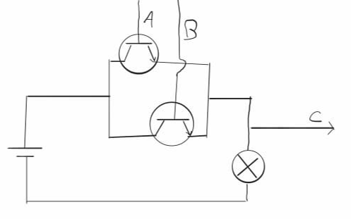
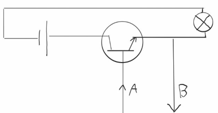

Elektronische logicapoorten 
-------------------------------------

In deze paragraaf gaan we kort kijken naar de elektronische variant van de volgende logicapoorten:

1. en-poort 
2. of-poort 
3. niet-poort 
4. xor-poort 

Allereerst, de en-poort. Deze werkt door twee schakelaren in de vorm van transistoren in serie te zetten in een circuit. Enkel wanneer 
beide transistoren geactiveerd zijn zal er stroom kunnen gaan lopen. Dit signaal kan doorlopen via een 3e draadje die het circuit verlaat.

.. figure:: _media/EnPoort.jpg    
    :alt: En poort
    :width: 500
    :align: center

    Voorbeeld van een elektronische en-poort.

De of-poort lijkt erg op de en-poort, maar de transistoren worden nu in parallel gezet in plaats van in serie. Dit zorgt ervoor wanneer er ook maar 
1 transistor is geactiveerd, het signaal al door wordt gegeven!

    Voorbeeld van een elektronische of-poort.

De niet poort heeft maar 1 transistor nodig! De niet poort sluit namelijk de spanningsbron aan op een transistor die wordt bestuurd door het 
input signaal. **Oeps dit plaatje en uitleg is fout TODO fix dit**

    Voorbeeld van een elektronische niet-poort.

**TODO xor poort? handig om dan de poorten als symbolen te doen**