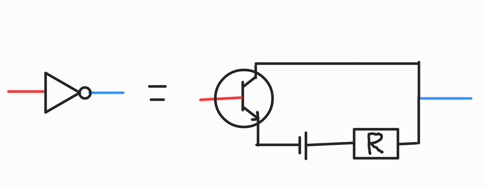
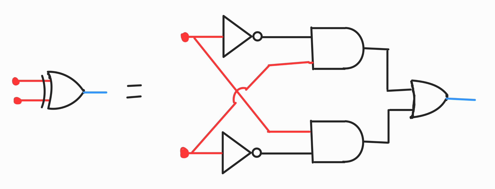

Elektronische logicamachines
-------------------------------------

In deze paragraaf gaan we kort kijken naar de elektronische variant van de volgende logicamachines:

1. niet-machine 
2. xor-machine 

De waarheidstabel van een niet-machine is als volgt:

=========== =========== 
niet-machine
-----------------------
A           niet A
=========== =========== 
Onwaar      Waar       
Waar        Onwaar     
=========== =========== 

De niet-machine is wat lastiger te begrijpen dan de en- en of-machines. het belangrijkste om te onthouden is dat een weerstand
geen spanningsverschil veroorzaakt tussen zijn begin en eind wanneer er geen stroom doorheen loopt. Kijk maar naar de
formule:
.. math::
    R=\frac{U}{I}
    U = I * R

Wanneer er geen stroom loopt (I = 0), is er dus ook geen spanningsverschil (U = 0). Met deze kennis kunnen we een niet-machine gaan begrijpen.
Zoals te zien in de afbeelding hieronder, staan er een transistor en een weerstand in serie. De linker lijn is de input, die de transistor aan of uit kan zetten. 
De rechter lijn is de output. Dooor deze lijn loopt nooit stroom, maar wordt enkel op spanning gezet, afhankelijk van onder welke spanning het deel van het circuit is waar het aan vastzit.
Wanneer de transistor aanstaat (input is "waar"), zal er stroom lopen door het hele circuit. Aangezien weerstand R de enige weerstand in het systeem is, zal deze alle spanning wegnemen. Dit betekent dat er geen spanning meer staat op het deel van het circuit waar de output aan zit.
De output is dan dus 0 Volt oftewel "onwaar". Wanneer de transistor uitstaat (input is "onwaar"), zal er geen stroom lopen. Er zal dus ook geen spanningsverschil zijn over de weerstand. Dit betekent dat de spanning van de output hetzelfde is als de spanning van 
de spanningsbron! De output is dan dus een hoog voltage en dus "waar". Let op: er loopt dus geen stroom in dit scenario.

    Voorbeeld van een elektronische niet-machine.

Dan gaan we nu kijken naar de xor-machine. De waarheidstabel van een xor-machine is als volgt:

============ ============ ============
xor-machine                       
--------------------------------------
A            B            A xor B   
============ ============ ============
Onwaar       Onwaar       Onwaar    
Onwaar       Waar         Waar      
Waar         Onwaar       Waar      
Waar         Waar         Onwaar    
============ ============ ============

De xor-machine is net zoals de en-, niet- en of-machines op te bouwen uit elektronische componenten. Echter is het makkelijker 
om een xor-machine te bouwen door gebruik te maken van een combinatie van en-, of- en niet-machines. We gebruiken dus de symbolen van deze machines in plaats van de gehele circuits.
Als je het circuit van een xorgate wil schetsen, hoef je enkel de symbolen te vervangen door de circuits die bij die machine hoort. Hierbij 
zijn de input draadjes die het symbool ingaan dus hetzelfde als de input draadjes die het circuit ingaan. In bovenstaande afbeelding van de niet-poort zie je bijvoorbeeld een symbool en het circuit waar het voor staat.

Zoals je kan zien in de afbeelding hieronder, is een xor-machine te bouwen door 2 en-machines, 2 niet-machines en 1 of-machine te combineren. 
Zoals je ziet, bestaat het uit een of-machine die als input twee keer een combinatie van een en-machine en een niet-machine krijgt. De output van de of-machine is de output van de xor-machine.
Laten we eens gaan kijken wat het betekent als een combinatie van een en-machine en een niet-machine "waar" geven:
We kijken naar de niet- en en-machine A combinatie. En-machine A heeft twee inputs: de output van niet-machine A en input B.
de output van niet-machine A is "waar" wanneer input A "onwaar" is, en "onwaar" wanneer input A "waar" is.
De inputs van de en-machine A zijn dus "niet input A" en "input B". De output van de en-machine A is dus "waar" wanneer input A "onwaar" is en input B "waar" is. In alle andere gevallen is de output van de en-machine A "onwaar".
De output beantwoord dus de vraag: "is input A onwaar en input B waar?". De niet- en en-machines B beantwoord op dezelfde manier 
de vraag: "is input A waar en input B onwaar?". De output van de of-machine is vervolgens enkel waar als een van deze vragen waar is. 
De output van de of-machine beantwoord dus de vraag: "is input A onwaar en input B waar, of is input A waar en input B onwaar?". Dit is precies wat een xor-machine doet! Wanneer beide 
waardes "waar" of "onwaar" zijn, zullen beide en-machines "onwaar" geven, en zal de output van de of-machine dus ook "onwaar" zijn.

    Voorbeeld van een elektronische xor-machine.

**TODO OUD EN WEGHALEN**

De niet-poort heeft slecht 1 input draadje en 1 output draadje. Wanneer er spanning staat op het input draadje zal er geen spanning staan op het output draadje en andersom. 
Het circuit werkt als volgt: wanneer er spanning staat op het input draadje is de transistor geactiveerd en zal er stroom kunnen lopen van het output draadje naar de grond. 
Hierdoor zal er geen spanning staan op het output draadje. Wanneer er geen spanning staat op het input draadje is de transistor niet geactiveerd en zal er stroom kunnen lopen door het circuit heen. Het blauwe output draadje staat dan direct in contact met de min-pool van de spanningsbron en zal dus een spanning van 0 volt hebben. Een input signaal van 1 resulteerd dus in een output signaal van 0. Wanneer er geen spanning staat op het input draadje is de stroomkring niet gesloten en loopt er geen stroom meer. De reden dat er nu wel spanning staat op het output draadje is omdat de weerstand geen spanningsval veroorzaakt wanneer er geen stroom loopt. Kijk maar naar de formule van de weerstand R:

Het output draadje zit nu dus effectief op dezelfde spanning als de plus-pool. Een input van 0 resulteerd dus in een 1. Als je vervolgens stroom gaat laten lopen door het output draadje door het bijvoorbeeld weer naar de min-pool van de spanningsbron te leiden zal er wel weer stroom gaan lopen en brengt de weerstand weer een spanningsval teweeg. De output zou dan weer 0 worden. Je mag dus niet stroom door het output draadje laten lopen. Wat kan je dan met een draadje waar geen stroom door mag lopen? Je zou het bijvoorbeeld aan kunnen sluiten op een andere logica poort waar het een transistor kan activeren met zijn spanning zonder dat er stroom voor nodig is!