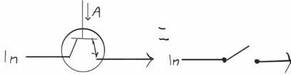
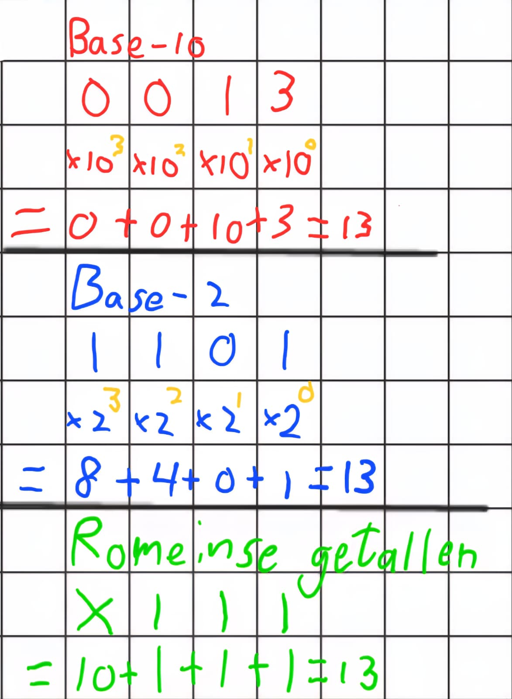
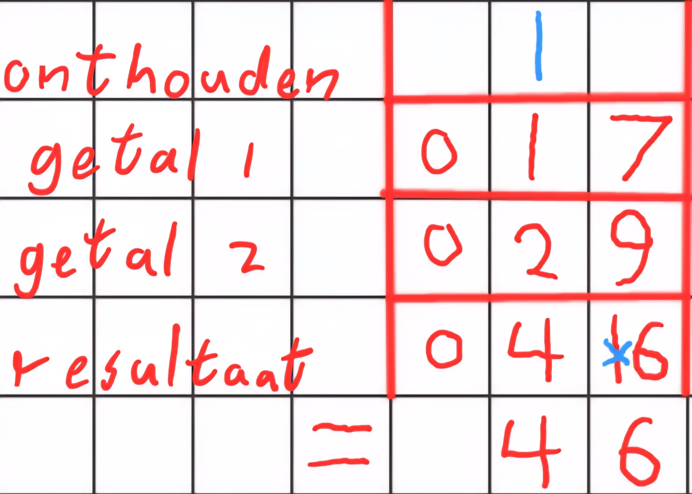
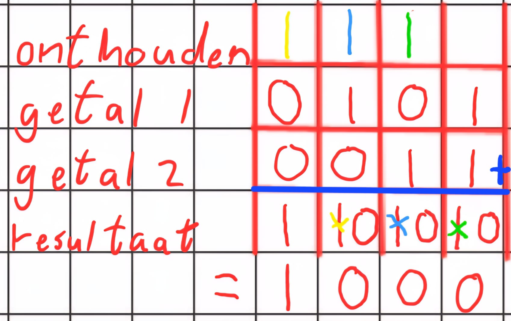
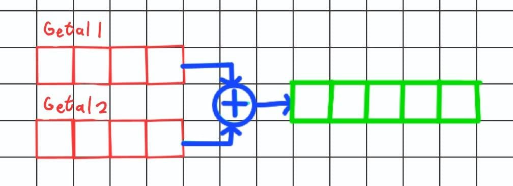
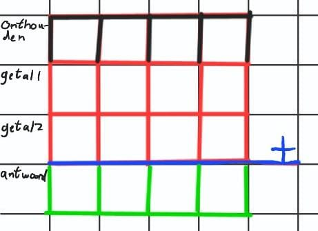
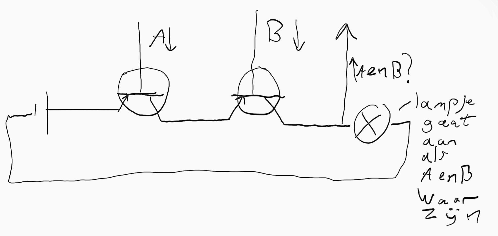
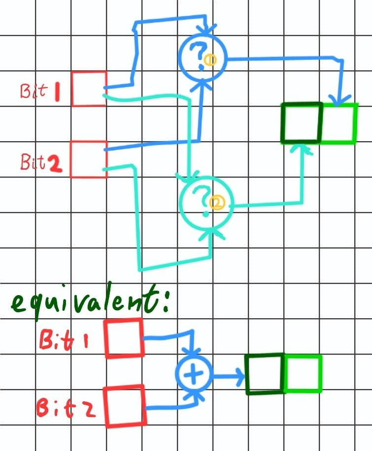
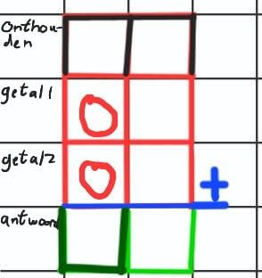
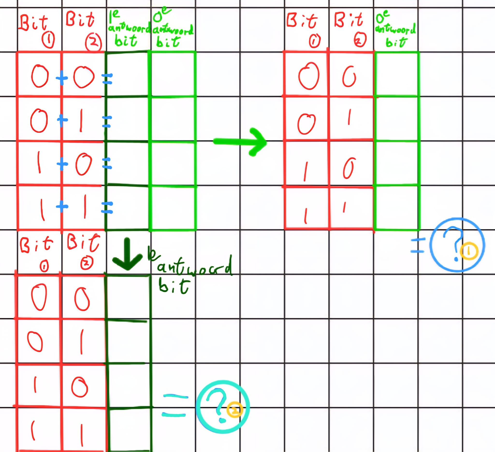

:orphan:

Elektronica
########################

Inleiding
-----------------

.. admonition:: info
   :class: margin

   Vind je het concept elektriciteit nog vaag? Lees dit dan even door:   :doc:`Elektrische schakelingen, hoe zat het ook alweer? <HoeZatHetOokalweer>`

Om een robot te maken hoef je niet per se een computertje in de robot te stoppen. 
Door enkel de juiste onderdelen samen te voegen kan je al een robotje maken die rond kan rijden! 
Je kan bijvoorbeeld twee lichtsensoren op de robot monteren die elektriciteit naar 
de motoren sturen als ze een lijn zien. Als je dit op de juiste manier aansluit kan het robotje een lijn volgen!
Dit worden Braitenbergmachines genoemd. Hieronder is zo'n robotje te zien.

.. figure:: https://mirte.org/_nuxt/MIRTE_lite_obstacle_sensor_transparant.Bry8uo3S.png
    :alt: Mirte lite
    :width: 300
    :align: center

    Een MIRTE Lite.

De belangrijkste les die je dit hoofdstuk gaat leren is de volgende: elk elektrische apparaat is uiteindelijk gemaakt 
van veel simpele bouwstenen die op zeer ingenieuze manieren zijn samengevoegd. Zodra je de onderdelen genaamd stroomdraad, weerstandje en transistor 
kent kan je al een gigantisch deel van een elektronisch onderdeel snappen!

In dit hoofdstuk gaan we kijken naar veel voorkomende onderdelen.
Voor dit hoofdstuk is het erg handig wat voorkennis te hebben van elektriciteit. Komen de termen spanning, stroomsterkte, lading, schakelaren en weerstanden je niet helemaal bekend voor? 
Lees dan vooral het stuk dat hier rechts staat! 

Transistors
-------------------

Bij natuurkunde heb je geleerd over allerlei elektronische onderdelen, waaronder de schakelaar. Uiteraard is het heel handig 
om een schakelaar te hebben die de stroom kan afkappen, maar het is niet handig dat dit altijd handmatig moet gebeuren. 
Gelukkig is er een manier gevonden om de schakelaar te bedienen met een andere stroomdraad! 
Dit wordt een transistor genoemd. Transistoren staan bekend als een van de beste uitvindingen van de afgelopen 100 jaar. 
En niet voor niets: het is een van de meest gebruikte onderdelen in talloze apparaten. Jouw smartphone alleen al heeft 
honderden miljarden transistors (dat is meer dan 100.000.000.000)!

In de figuur hieronder is te zien hoe deze werkt. Er komtvanaf links een draad binnen. Wanneer er een spanning wordt gezet 
op draad A ontstaat er een verbinding tussen het linker- en rechterdeel en kunnen de elektronen verder stromen. Dit kan dus gebruikt worden om de stroom uit te zetten, 
maar het kan ook gebruikt worden om het signaal van A te versterken. A mag namelijk heel zwak zijn om de verbinding te laten ontstaan. Als je de linkerdraad aansluit op een sterke spanningsbron 
kan je een sterk signaal aan de rechterkant laten ontstaan als er een zwak signaal via A binnenkomt. Als A geen signaal binnenbrengt blijft de rechterdraad spanningsloos. 
Hiermee versterk je dus effectief het signaal van A.

    Een transistor

Binaire getallen
-------------------------

Je hebt misschien al eens 
gehoord dat computers werken met enkel binaire getallen. Dat betekent dat ze elk getal opslaan als 
een combinatie van eenen en nullen. Door middel van onze transistoren kunnen we deze losse cijfertjes opslaan! Als de transistor aan staat, 
heeft het een waarde van 1 en als het uit staat een waarde van 0. Door meerdere van deze naast elkaar te zetten kunnen we grote getallen opschrijven!
Het lijkt eigenlijk best wel op onze manier van getallen schrijven, behalve dat wij de getallen van 0 tot 9 gebruiken. Dit heet talstelsel 10. Wanner je enkel de getallen 
0 en 1 gebruikt is dat talstelsel 2 (ook wel binaire getallen of base 2). We noemen het meest insignificante cijfer (het meest rechtercijfer) het nulde cijfer, het cijfer links daarvan het eerste cijfer, enzovoort.

    Manieren om 13 te schrijven

Bij ons is het nulde cijfer 1 waard en elk cijfer daar links van steeds 10 keer meer. Kijk bijvoorbeeld 
naar 342. Het nulde cijfer voegt 1 * 2 = 2 aan het totaal toe. Het eerste cijfer (de 4) 
voegt 4 * 10 toe aan het totaal. Het tweede cijfer voegt 3 * 10 * 10 = 300 toe aan het totaal.

Bij binaire getallen is het nulde cijfer ook 1 waard. Elk cijfer links daarvan is echter 
steeds 2 keer zoveel waard in plaats van 10. Kijk bijvoorbeeld naar 1011: het nulde cijfer voegt 1*1 = 1 toe aan het totaal. Het eerste cijfer links daarvan 
voegt 1 * 2 = 2 toe aan het totaal. Het tweede cijfer voegt 0 * 2 * 2 = 0 toe aan het totaal. 
Het derde cijfer voegt 1 * 2 * 2 * 2 = 8 toe aan het totaal. 1 + 2 + 8 = 11 dus 11 als binair getal is 1011! 
Een enkel binair cijfertje heet een bit. 1011 bestaat dus uit 4 bits. 8 bits worden samen ook wel een byte genoemd. 
De opslag op je telefoon wordt bijvoorbeeld vaak uitgedrukt in gigabytes.

Het talstelsel bepaalt 
alleen maar hoe je een bepaalde hoeveelheid opschrijft, niet hoeveel je van iets hebt. Als je bijvoorbeeld 5 appels hebt, kan je 
ervoor kiezen dat op te schrijven als "5" als je base 10 wil gebruiken. Je kan het ook opschrijven als 101 in base 2. De schrijfwijze 
heeft dus geen effect op de onderliggende hoeveelheid. Je zou dus ook 5 kunnen opschrijven als "V" in romeinse cijfers.
101 in base 2 is exact hetzelfde als 5 in base 10 en ook als 5 in romeinse cijfers. 

De reden dat een computer met binaire getallen werkt is omdat ze erg simpel zijn om op te slaan. 
Je hoeft alleen maar een transistor te activeren om een 1 weer te geven of uit te laten voor een 0. Als je 32 van 
die transistors naast elkaar zet kan je een flink getal opslaan. 
Om elk cijfer tussen de 0 en 9 op te kunnen slaan zou je een veel ingewikkelder onderdeeltje nodig hebben. 
In de praktijk is het makkelijker om een aantal transistoren te gebruiken 
in plaats van zo'n complexer onderdeeltje. Je zou bijvoorbeeld zo'n complex deeltje kunnen maken 
door er 4 transistoren in te stoppen die samen de 16 mogelijke combinaties van 4 bits kunnen opslaan.
Hiermee kan je dus elk cijfer tussen de 0 en 9 opslaan, maar je hebt dan ook nog 6 combinaties over die niet gebruikt worden. 
Binaire getallen zijn dus een stuk efficiënter om op te slaan met transistoren dan getallen in base 10.

    17 + 29 optellen in base 10 **mist blauwe lijn**

    5 + 3 optellen in base 2

Binaire getallen optellen is niet moeilijker dan getallen vanuit base 10. Wanneer je 17 en 29 wil optellen (in base 10) kan je 
eerst 7+9 = 16 uitrekenen. Je schrijft de 6 op als nulde cijfer en onthoudt de 1. Onthoud dat het meest rechter 
cijfer het nulde cijfer genoemd wordt, het cijfer links daarvan het eerste, enzovoort. Om het eerste cijfer uit te rekenen doe je 1 + 2 (van 17 en 29) + 1 (die je onthield) = 4. Je schrijft de 4 op als eerste cijfer en je hebt het antwoord: 46.
Om hetzelfde te doen bij binaire getallen voer je exact dezelfde stappen uit. 

We willen 101 en 11 optellen. Eerst tellen we de 
twee nulde cijfers op: 1 + 1 = 10 (in base 2). We schrijven de 0 op als nulde getal en onthouden de 1. Dan gaan we het 
eerste cijfer uitrekenen: we tellen de eerste cijfers van 101 en 11 op en tellen daar de 1 die we onthouden bij op: 0+1+1 = 10. We schrijven de 0 op 
als eerste cijfer en onthouden de 1. Nu tellen we de tweede cijfers van 101 en 11 en tellen daar nog de onthouden 1 bij op (Let op:
Het tweede cijfer van 11 is 0: 11 is namelijk gelijk aan 011). Dan krijgen we: 1 + 0 + 1 = 10. We schrijven de 0 op en onthouden de 1. Zowel 101 als 11 hebben 
als derde cijfer 0, dus schrijven we onze onthouden 1 op als derde cijfer. Het antwoord is dan 1000! Dit kunnen we narekenen:
101 (5 in base 10) + 11 (3 in base 10) = 1000 (8 in base 10)!

In de de rest van het hoofdstuk gaan we kijken naar hoe we kunnen rekenen met binaire getallen. In de context van elektronica is het 
handig om wiskundige bewerkingen te zien als machines. Je noteert dan de getallen die je als ingangsignaal wil geven aan de linkerkant, 
en het antwoord dat eruit komt aan de rechterkant. Een optelmachine zou er als volgt uit kunnen zien:

    Optelmachine

**Opdracht 1**

In deze opdracht gaan we oefenen met het omschrijven van getallen tussen base 2 en base 10, en het optellen van binaire getallen.

a. Schrijf de volgende getallen op in base 2: 0, 1, 2, 3, 4, 5, 6, 7, 8, 9, 10, 11.

b. Reken de som uit van 4 + 7 uit in base 2. Gebruik onderstaand diagram als basis.  

c. Reken de som van 3 + 6 uit. Gebruik bovenstaand diagram.

    

Logische poorten en waarheidstabellen
-----------------------------------------

Om een computer te maken moeten we een samenstelling van onderdeeltjes vinden die in de basis de volgende twee dingen kan: 

1. Getallen opslaan.
2. Simpele wiskundige berekeningen doen.

Met deze twee acties kunnen we al veel bereiken! Door simpele wiskundige berekeningen aan elkaar te koppelen kunnen we ook complexe problemen oplossen.
Om getallen op te slaan gebruiken we zoals in de vorige paragraaf vermeld transistoren. Deze transistoren slaan binaire getallen op. Hiermee voldoen we aan punt 1.

Om aan punt 2 te voldoen heeft een computer bijvoorbeeld onderdelen die twee getallen kunnen optellen of vermenigvuldigen. Echter zijn deze onderdelen zelf gemaakt uit nog kleinere onderdelen: 
hoofdzakelijk logische poorten. Deze poorten kunnen als het ware steeds 1 logische denkstap uitvoeren. 
De poorten werken met twee waardes: waar en onwaar (1 en 0). We gaan nu kort kijken naar 4 verschillende poorten die allemaal een andere logische denkstap uitvoeren.

We beginnen met een en-poort Deze poort krijgt twee waardes gegeven, en geeft dan de waarde waar terug als de eerste en
de tweede waardes waar zijn, en anders onwaar. De waarheidstabel van deze poort is als volgt:

========== ========== ==========
en-poort                        
--------------------------------
A          B          A en B    
========== ========== ==========
Onwaar     Onwaar     Onwaar    
Onwaar     Waar       Onwaar    
Waar       Onwaar     Onwaar    
Waar       Waar       Waar      
========== ========== ==========

De of-poort geeft "waar" terug als ten minste 1 van de 2 gegeven waardes waar is. Daar hoort de volgende waarheidstabel bij:

========== ========== ==========
of-poort                        
--------------------------------
A          B          A of B    
========== ========== ==========
Onwaar     Onwaar     Onwaar    
Onwaar     Waar       Waar      
Waar       Onwaar     Waar      
Waar       Waar       Waar      
========== ========== ==========

De exclusieve of-poort geeft waar terug als enkel de eerste of enkel de tweede waarde waar is. Wanneer beide waardes waar zijn is het resultaat dus onwaar. 
In het engels wordt deze poort ook wel de xor-poort genoemd. De waarheidstabel van deze poort is als volgt:

========== ========== ==========
xor-poort                       
--------------------------------
A          B          A xor B   
========== ========== ==========
Onwaar     Onwaar     Onwaar    
Onwaar     Waar       Waar      
Waar       Onwaar     Waar      
Waar       Waar       Onwaar    
========== ========== ==========

Ten slotte heb je ook nog de niet-poort. Deze poort krijgt 1 waarde binnen en geeft het tegenovergestelde terug. De waarheidstabel van deze poort is als volgt:

=========== =========== 
niet-poort
-----------------------
A           niet A
=========== =========== 
Onwaar      Waar       
Waar        Onwaar     
=========== =========== 

.. admonition:: info
   :class: margin

   Wil je weten hoe je de andere poorten daadwerkelijk maakt als circuit? Lees dan dit stukje:   :doc:`Hoe maak je poorten? TODO daadwerkelijk schrijven <LogicaPoorten>`

Hiermee kunnen we dus een bit (een 1 of een 0) krijgen door een of twee bits aan de poort te leveren. Door deze poorten aan elkaar te koppelen kunnen we 
steeds complexere onderdelen maken. Stel dat je het resultaat van een en-poort ook nog door de niet-poort zou leiden: Je krijgt dan enkel Onwaar als beide inputs 
Waar waren. Het geeft dan dus antwoord op de vraag: Zijn niet beide inputs Waar? De xor-poort kan zelf gemaakt worden door en-poorten, niet-poorten en een of-poort op de juiste manier aan elkaar te koppelen. 

In de context van elektronica komen de waardes van waar en onwaar overeen met ofwel of er spanning op een kabel staat ofwel of er lading in een onderdeeltje zit.  
Hieronder zie je hoe je bijvoorbeeld een en-poort maakt.
Door spanning te zetten op draden A en B kan je stroom al dan niet laten lopen. Wanneer er spanning staat op zowel A als B, 
zal het lampje gaan branden en komt er spanning te staan op draad C. Door draad C door een niet-poort te halen kan je de poortcombinatie van hierboven nabouwen!

    Voorbeeld van een elektronische en-poort.

Stel nu dat we twee getallen hebben opgeslagen, beide met 1 bit (1 transistor die een 1 of 0 opslaat). 
Hoe kunnen we dan deze getallen optellen? Dit doen we door de juiste logische poort(en) te gebruiken op de bits. De optelmachine zou er als volgt uitzien:

    Optelmachine voor 2 bits 

Hierbij zijn de twee vraagtekens logische poorten. Nu moeten we enkel nog uitzoeken welke dan precies.
In de volgende opdracht gaan we ontdekken welke logische poorten we moeten toepassen om dit uit te rekenen.

**Opdracht 1**
    
We willen bepalen welke poorten we nodig hebben om de som van 2 bits te berekenen. We hebben dus twee cijfers die ofwel 0 ofwel 1 gaan zijn 
en willen weten hoe we het resultaat kunnen berekenen. 

a. Wat zijn alle antwoorden die mogelijk zijn?
    Gebruik eventueel het diagram als basis. Schrijf de mogelijke antwoorden op in base 2:

| 0 + 0 = ? (base 2) 
| 0 + 1 = ? (base 2) 
| 1 + 0 = ? (base 2) 
| 1 + 1 = ? (base 2) 

b. Hoeveel bits heb je nodig zodat elk mogelijke antwoord opgeslagen kan worden?
    Tip: Met 1 bit kan je alleen 0 en 1 opschrijven, terwijl je met 8 bits bijvoorbeeld al de getallen 0 tot en met 255 kan opslaan.

d. Maak de waarheidstabellen hieronder af die het effect van de twee inputs op de optelsom tonen.

    Waarheidstabellen

**TODO: IPV de tabel linksboven als tabel weer te geven meer focussen op dat het 4 optelsommen zijn, en dan grafische weergeven welke rij je waar neer moet 
zetten om de 2 waarheidstabellen te krijgen** 

e. De twee waarheidstabellen die bij de vraagtekens horen zijn als het goed is gelijk aan een van de bovenstaande tabellen van de bestaande poorten! Welke poorten zijn dat?

Als je weet hoe je de 2 poorten van hierboven moet bouwen, kan je nu dus ook een onderdeeltje bouwen die 2 bits kan optellen! Door dit 
soort systemen aan elkaar te koppelen op steeds grotere schaal kan je complexe machines maken!

Modules
-----------------------------------------

Door logische poorten en losse onderdeeltjes zoals weerstanden aan elkaar te schakelen kunnen we modules maken. 
Modules zijn een brede term voor onderdelen 
die een specifieke taak kunnen uitvoeren binnen je stroomnetwerk. 
Een simpele variant hiervan is een H-brug. Dit wordt gebruikt om de stroomrichting door een draad 
om te kunnen keren. In het plaatje hieronder zie je een motor M met daaromheen de H-brug. Zoals je ziet kunnen 
we kiezen aan welke kant de stroom binnenkomt en aan welke kant de stroom weggaat: We kunnen schakelaars s1 en s4 OF schakelaars s2 en s3 tegelijk sluiten 
om de stroomrichting te kiezen. We kunnen de draairichting van een motor hiermee omdraaien! 

.. figure:: https://upload.wikimedia.org/wikipedia/commons/thumb/d/d4/H_bridge.svg/960px-H_bridge.svg.png
    :alt: Een H-brug
    :width: 300
    :align: center

    Een H-brug (COPYRIGHT?)

Een andere module die veel voorkomt is een *analog to digital converter* (ADC). Dit is 
een onderdeel die een analoog signaal kan vertalen naar een digitale binaire waarde. Er is namelijk een probleem 
als je bijvoorbeeld een temperatuursensor wil aflezen met je computer. De sensor geeft een bepaalde spanning door via de verbindingskabel, die overeenkomt met een bepaalde temperatuur aan 
de hand van een formule die bij de sensor hoort. De computer kan niet direct de spanning opslaan 
om mee te rekenen. Het moet de spanning omzetten naar een binair getal die deze spanning uitdrukt in volt. 
Het onderdeel die deze omzetting kan doen is dus de AD converter. Je hebt ook een *digital to analog converter* (DAC). Deze 
doet dezelfde taak, maar dan andersom. Dit wordt bijvoorbeeld gebruikt om de digitale muziek van je computer om te zetten naar een analoog signaal voor speakers.

.. figure:: https://www.embedded.com/wp-content/uploads/sites/2/2025/01/Figure-1.png
    :alt: Een AD en DA converter
    :width: 300
    :align: center

    Een ADC en een DAC (COPYRIGHT?)

Tegenwoordig hebben de meeste apparaten ook een module die veel geavanceerder is dan een simpel weerstandje of transistor: een rekenchip. 
Met zo'n chip kan je lastige berekeningen uitvoeren en allerlei dingen aansturen. Een voorbeeld van zo'n chip is een 
*CPU* (central processing unit). Een goeie analogie van een *CPU* is 10 professoren. Een *CPU* kan een aantal lastige 
berekeningen tegelijkertijd uitvoeren. Voor veel taken is het echter handig om veel meer mensen te hebben die wat minder goed zijn in rekenen. Denk bijvoorbeeld 
aan het creeeren van het beeld dat je op je scherm ziet. Op je scherm moeten er miljoenen pixels een kleur krijgen, en dat tientallen keren per seconde! Dit is per 
pixel geen moeilijke taak, maar het is wel een gigantische hoeveelheid werk. Daarom hebben we ook *GPU's* (graphics processing units). Deze zijn gemaakt om veel simpele taken tegelijk uit te voeren.
Omdat *CPU's* en *GPU's* zo breed toepasbaar zijn, verliezen ze wel wat snelheid. Een directe schakeling van logica poorten die precies 
de rekensom uitvoert die je nodig hebt zal altijd sneller zijn dan een *CPU* of *GPU* die een programma draait dat deze rekensom uitvoert. Daarom hebben we ook nog *FPGA's* (field programmable gate arrays). 
Deze kunnen ook geprogrammeerd worden om allerlei berekeningen te doen, maar deze creeërt een fysieke schakeling van de juiste logische poorten 
om de berekening uit te voeren. Hierdoor is het sneller dan een *CPU* of *GPU*, maar ook veel minder flexibel. Daarnaast zijn ze vaak ook erg duur.

.. figure:: https://asset.conrad.com/media10/isa/160267/c1/-/nl/1172623_BB_00_FB/image.jpg
    :alt: microcontroller
    :width: 300
    :align: center

    Een microcontroller (COPYRIGHT?)

Voor een robotje is al deze rekenkracht echter vaak niet zo belangrijk. Belangrijker is dat de robot zo snel mogelijk kan reageren op zijn omgeving. Je wil bijvoorbeeld dat de robot meteen een bocht maakt als hij een muur ziet, in plaats van dat hij eerst een programma op een grote CPU moet draaien om te bepalen of hij een bocht moet maken.
Om deze reden wordt meestal een *microcontroller* gebruikt in een robot. Deze is veel minder krachtig dan een CPU, maar is wel erg snel en zuinig met energie. Daarnaast zijn ze vaak 
ook erg goedkoop.
Je kan er programmeercode op zetten om allerlei andere onderdelen aan te sturen. 
Je zou bijvoorbeeld kunnen programmeren dat wanneer er spanning staat op twee aangesloten stroomdraden, er ook spanning moet 
worden gezet op een derde uitgaande stroomdraad. Je hebt nu een *en-poort* gemaakt! Een microcontroller kan nog veel complexere taken 
uitvoeren dan dat. Het is niet een krachtige computer, 
maar je komt al heel ver met wat simpele berekeningen als je een robot wil aansturen. 
